# Arquitectura AWS — RetailStore

## Diagrama de Infraestructura

```mermaid
graph LR
    %% ── Estilos Generales ─────────────────────────────────────────────
    classDef default fill:#F8F9FA,stroke:#D2D6DC,stroke-width:1px,color:#232F3E;
    classDef aws fill:#FF9900,stroke:#232F3E,stroke-width:1.5px,color:#FFFFFF,font-weight:bold
    classDef ecs fill:#FF6B35,stroke:#232F3E,stroke-width:1.5px,color:#FFFFFF,font-weight:bold
    classDef data fill:#3F8624,stroke:#232F3E,stroke-width:1.5px,color:#FFFFFF,font-weight:bold
    classDef security fill:#DD344C,stroke:#232F3E,stroke-width:1.5px,color:#FFFFFF,font-weight:bold
    classDef cicd fill:#4A90D9,stroke:#232F3E,stroke-width:1.5px,color:#FFFFFF,font-weight:bold
    classDef infra fill:#7D4E9E,stroke:#232F3E,stroke-width:1.5px,color:#FFFFFF,font-weight:bold

    %% ── Internet ─────────────────────────────────────────────────────
    subgraph INTERNET["🌐 Internet"]
        USER([🌐 Usuarios])
        ADMIN_USER([🔧 Administradores])
    end

    %% ── AWS Cloud ────────────────────────────────────────────────────
    subgraph AWS["☁️ AWS (us-east-1)"]

        %% ── Herramientas de Despliegue ───────────────────────────────
        subgraph CICD["🚀 Automatización CI/CD"]
            GH["🔧 GitHub Actions\ndeploy.yml"]
            TF["🏗️ Terraform IaC"]
        end

        subgraph TF_STATE["📂 Estado de Backend IaC"]
            S3[("🪣 S3\nTerraform State")]
            DDB[("🔒 DynamoDB\nState Lock")]
        end

        %% ── Servicios de Plataforma Centralizados ────────────────────
        subgraph PLATFORM["⚙️ Servicios AWS Administrados"]
            ECR["📦 ECR\n6 repositorios"]
            SM["🔐 Secrets Manager\nDB credentials"]
            CW["📊 CloudWatch\nLogs + Metrics"]
            SNS["📧 SNS\nAlertas de seguridad"]
            LAMBDA["λ Lambda\necr-scan-notifier"]
            EB["⚡ EventBridge\nECR Scan Complete"]
        end

        %% ── Red Principal (VPC) ──────────────────────────────────────
        subgraph VPC["🌐 VPC (10.x.0.0/16)"]

            subgraph PUB["Subnets Públicas (AZ-1 / AZ-2)"]
                IGW["🌐 Internet Gateway"]
                ALB["🔀 Application Load Balancer\nHTTP :80"]
                NAT["🔁 NAT Gateway"]
            end

            subgraph PRIV["Subnets Privadas (AZ-1 / AZ-2)"]

                subgraph ECS["🐳 ECS Cluster — AWS Fargate"]
                    SVC_UI["ui\nExpress :3000"]
                    SVC_ADMIN["admin\nExpress :3001"]
                    SVC_CATALOG["catalog\nGo :8001"]
                    SVC_CART["cart\nPython :8002"]
                    SVC_CHECKOUT["checkout\nNestJS :8003"]
                    SVC_ORDERS["orders\nGo :8004"]
                end

                subgraph DATA["🗄️ Capa de Datos"]
                    RDS[("🗄️ RDS PostgreSQL 16\nMulti-AZ")]
                    REDIS[("⚡ ElastiCache Redis 7\nSesiones")]
                end
            end
        end
    end

    %% ── FLUJOS DE ENTRADA Y RED ──────────────────────────────────────
    USER & ADMIN_USER -->|"HTTP"| IGW
    IGW --> ALB
    
    ALB -->|":3000"| SVC_UI
    ALB -->|":3001"| SVC_ADMIN
    ALB -->|":8001"| SVC_CATALOG
    ALB -->|":8002"| SVC_CART
    ALB -->|":8003"| SVC_CHECKOUT
    ALB -->|":8004"| SVC_ORDERS

    %% ── INTERCOMUNICACIÓN DE SERVICIOS ──────────────────────────────
    SVC_UI --> SVC_CATALOG & SVC_CART
    SVC_CHECKOUT --> SVC_ORDERS
    SVC_CART & SVC_CHECKOUT --> REDIS

    %% ── CAPA DE PERSISTENCIA Y CONFIGURACIÓN ─────────────────────────
    SVC_CATALOG & SVC_CART & SVC_CHECKOUT & SVC_ORDERS --> RDS
    SM -.->|"Inyecta Credenciales"| SVC_CATALOG & SVC_CART & SVC_CHECKOUT & SVC_ORDERS

    %% ── TRÁFICO SALIENTE Y MONITOREO ─────────────────────────────────
    ECS -->|"Egress"| NAT
    NAT --> IGW
    ECS -.->|"Envía Métricas"| CW

    %% ── PIPELINE DE SEGURIDAD AUTOMATIZADO ───────────────────────────
    ECR -->|"Scan Event"| EB
    EB --> LAMBDA
    LAMBDA --> SNS
    SNS -.->|"Alerta Email"| ADMIN_USER

    %% ── FLUJO CI/CD Y PROVISIONAMIENTO ────────────────────────────────
    GH -->|"Docker Push"| ECR
    GH -->|"Dispara"| TF
    TF -->|"Provisiona"| VPC
    TF --> S3 & DDB
    ECR -.->|"Pull Image"| ECS

    %% ── Asignación de Clases Estilizadas ──────────────────────────────
    class ECR,S3,DDB,CW,SNS aws
    class SVC_UI,SVC_ADMIN,SVC_CATALOG,SVC_CART,SVC_CHECKOUT,SVC_ORDERS ecs
    class RDS,REDIS data
    class SM,LAMBDA,EB security
    class GH,TF cicd
    class ALB,IGW,NAT infra

```

---

## Descripción de Componentes

### Red (VPC)

| Componente | Tipo | Detalle |
|-----------|------|---------|
| VPC | Red privada | CIDR diferenciado por ambiente: dev `10.0.0.0/16`, test `10.1.0.0/16`, prod `10.2.0.0/16` |
| Subnets públicas | 2 AZs | Alojan el ALB y el NAT Gateway |
| Subnets privadas | 2 AZs | Alojan todas las tareas ECS, RDS y Redis |
| Internet Gateway | Entrada pública | Tráfico entrante de usuarios |
| NAT Gateway | Salida a internet | Permite que ECS descargue imágenes de ECR sin IP pública |
| Application Load Balancer | Balanceo | Distribuye tráfico HTTP hacia los 6 servicios por puerto |

### Microservicios (ECS Fargate)

| Servicio | Runtime | Puerto | Función |
|---------|---------|--------|---------|
| ui | Express / Node.js | 3000 | Frontend de clientes |
| admin | Express / Node.js | 3001 | Panel de administración |
| catalog | Go | 8001 | Catálogo de productos |
| cart | Python / FastAPI | 8002 | Carrito de compras |
| checkout | NestJS | 8003 | Proceso de pago |
| orders | Go | 8004 | Gestión de órdenes |

### Datos

| Componente | Servicio AWS | Detalle |
|-----------|-------------|---------|
| Base de datos | RDS PostgreSQL 16 | Multi-AZ en prod, single-AZ en dev/test |
| Sesiones / Cache | ElastiCache Redis 7 | Compartido por cart y checkout |
| Credenciales | Secrets Manager | Contraseñas nunca en texto plano ni en código |

### Seguridad

| Componente | Propósito |
|-----------|-----------|
| ECR scan on push | Escaneo automático de vulnerabilidades al publicar imagen |
| EventBridge | Captura evento `ECR Image Scan Complete` |
| Lambda `ecr-scan-notifier` | Evalúa findings CRITICAL/HIGH y publica en SNS |
| SNS | Notifica al equipo vía email cuando hay vulnerabilidades críticas |

### Observabilidad

| Componente | Qué monitorea |
|-----------|--------------|
| CloudWatch Logs | Logs estructurados de los 6 servicios (`/retailstore/<env>/<service>`) |
| CloudWatch Metrics | CPU, memoria, request count, latencia del ALB, conexiones RDS |
| CloudWatch Dashboard | Vista unificada de métricas operativas por ambiente |

### CI/CD e IaC

| Componente | Rol |
|-----------|-----|
| GitHub Actions | Build, scan, push a ECR, terraform apply |
| Terraform | Provisiona toda la infraestructura como código |
| S3 + DynamoDB | Estado remoto de Terraform con locking |

---

## Diferencias por Ambiente

| Parámetro | dev | test | prod |
|-----------|-----|------|------|
| ECS desired count | 1 | 1 | 2 |
| RDS instance | db.t3.micro | db.t3.small | db.t3.medium |
| RDS Multi-AZ | ✗ | ✗ | ✓ |
| Log retention | 30 días | 30 días | 90 días |
| Deletion protection | ✗ | ✗ | ✓ |
| Aprobación manual deploy | ✗ | ✗ | ✓ |
