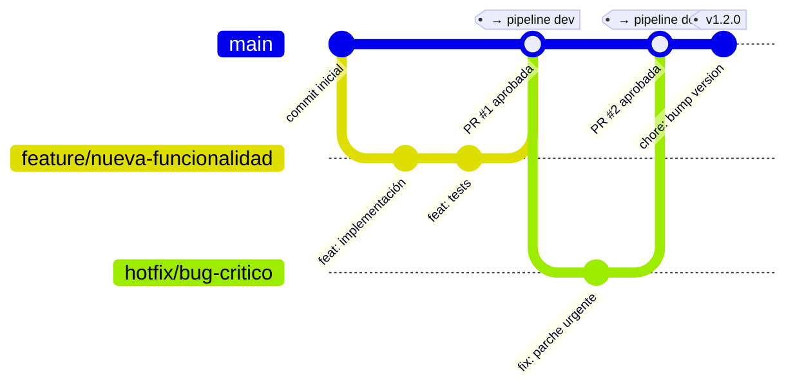

# Estrategia de Ramas — GitHub Flow

Estrategia adoptada: **GitHub Flow** (ver [ADR 001](../adr/001-github-flow.md)).
Tronco único `main` protegido. Todo cambio entra por Pull Request revisada y aprobada.

## Diagrama



## Flujo de promoción entre ambientes

```
feature/* ──(PR + review)──► main ──(push automático)──► deploy dev
                                  ──(workflow_dispatch)──► deploy test
                                  ──(workflow_dispatch + aprobación)──► deploy prod
```

| Trigger | Ambiente | Aprobación requerida |
|---------|----------|----------------------|
| Push a `main` vía PR | **dev** | 1 revisor en PR (branch protection) |
| `workflow_dispatch environment=test` | **test** | ninguna extra |
| `workflow_dispatch environment=prod` | **prod** | aprobador en GitHub Environment (`PROD_APPROVERS`) |

## Convenciones de nombres de rama

| Tipo | Patrón | Ejemplo |
|------|--------|---------|
| Nueva funcionalidad | `feature/<descripción>` | `feature/cart-schema-init` |
| Corrección urgente | `hotfix/<descripción>` | `hotfix/cart-500-fix` |
| Experimento | `spike/<descripción>` | `spike/redis-session-poc` |

## Reglas de protección en `main-prod`

Configuradas en GitHub → Settings → Branches (ver [guía de configuración](../runbooks/branch-protection-setup.md)):

- PR obligatoria con ≥1 aprobador distinto al autor
- Status checks requeridos: `secret-scan`, `sast`, `sca`
- Rama actualizada antes de merge
- Push directo bloqueado (solo admins)
